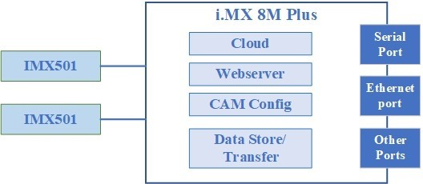
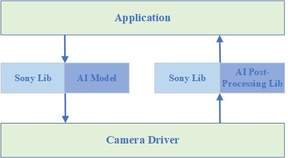
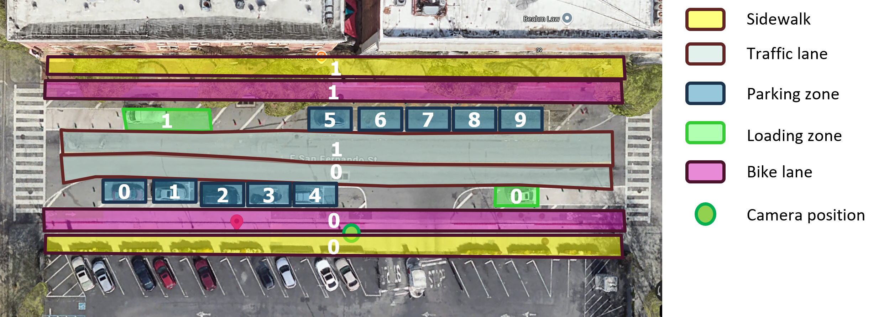

# GS500 SDK V1.7 Base Socket

## Overview

This document provides information about the GS500 software development kit (SDK) to facilitate integration with any third-party software. It emphasizes on explaining the capabilities of the device and the recommended data exchange methods. 

## Modification Record

| Version | Description                                                  | Author  | Date       |
| ------- | ------------------------------------------------------------ | ------- | ---------- |
| v1.0    | The first version                                            | Mr.Pang | 2024.11.8  |
| v1.1    | 1.Added some input and output parameters in Chapter 3.  <br>2.The Section 3.3 has been added to describe the CSD standard. <br>3.The error codes are classified in chapter 4. | Mr.Pang | 2024.11.15 |
| v1.2    | 1.Add a software version of the development environment in Section 2.1.<br>2.Change must to require in Section 3.<br>3.Remove Chapter 4. | Mr.Pang | 2024.11.19 |
| v1.3    | 1.Update the section 3.3 for CDS json                        | Mr.Pang | 2024.12.4  |
| v1.4    | Chapter 3.3 was refactored to describe this in detail        | Mr.Pang | 2024.12.6  |
| v1.5    | Update the section 3.3 for CDS json, the current version is v1.0.2 | Mr.Pang | 2024.12.26 |
| v1.6    | Update the section 3.3 for CDS json, the current version is v1.0.3 | Mr.Pang | 2025.2.5   |
| v1.7    | 1.Modified upload and download file chapters for easier use<br />2.Removed ROI functionality that was not implemented for the time being<br />3.Added functional implementation of CDS standards in section 3.2,replacing the original sample section.<br />4.Remove the error code and add a message field in the response to indicate the actual error, which is more intuitive<br />5.Updated chapter 5 on debugging to include log files to help locate problems. | Mr.Pang | 2025.3.14  |

## 1. Hardware Architecture 

### 1.1 Overview

This system mainly consists of one or two IMX501 sensors, one i.MX 8M Plus SOM, and some peripheral parts.

### 1.2 IMX501

IMX501 is to capture images and do inference.



### 1.3 i.MX 8M Plus SOM 

On the i.MX 8M Plus Linux system, it runs the applications for postprocessing for IMX501 data. The architecture is as below:



#### 1.3.1 Application

This is developed by Leopard for application upper level.

#### 1.3.2 Sony Lib

This is Sony Smart Camera Edge API (SC Edge API) Library to communicate with the IMX501.

#### 1.3.3 AI Model

This is the AI model, will be called by Sony Library and sent to IMX501 sensor for inference,allow the use of AI vendor models to improve product performance.

#### 1.3.4 AI PostProcess Lib

After getting the inference data from IMX501 sensor, this Lib will do postprocess, allows AI vendor to provide customized post-processing functions.

#### 1.3.5 Camera Driver

This is developed by Leopard to control the sensor.


------

## 2.Development Environment

We support two development modes, and customers can use appropriate methods to develop applications according to their own needs.

### 2.1 The application needs to run on GS500

To connect to GS500 via SSH, the following commands are commonly used:

```shell
#login in use root 
Account: root
Password: root

#stop services
systemctl stop aglaia.service
systemctl disable aglaia.service

#reboot system
reboot
```

Release version: **mx8mp-yocto-kirkstone-5.15.71_2.2.0-v1.2**

### 2.2 The application needs to run on other devices(TBD)

Users can interact with GS500 through network socket on any other device.


------

## 3.API Reference

Messaging based on socket mode, the message body using the json format.The listening port for transmitting messages is **880**. When data transfer is required, a connection socket will be created on the device side with port **881** for data transfer.The following details the specific format of the json:

#### 3.1 For Software Companies

##### 3.1.1 Get Device Information

**[Request Message]**


```json
{
    "cmd": "get_dev_info_req"   
}
```

**[Response Message]**

```json
{
    "cmd": "get_dev_info_rsp",
    "ret_code": 0,
    "product_model": "xxx",
    "sdk_version": "xxx",
    "camera_num": "dual",
    "sn": "xxxx"
}
```

**[Parameter Description]**

| Name          | Description                                                  | Require/Option |
| ------------- | ------------------------------------------------------------ | -------------- |
| cmd           | cmd keyword                                                  | R              |
| ret_code      | return code,0:success !0:fail, If error, please view the chapter 4. | R              |
| product_model | product model description                                    | R              |
| sdk_version   | current sdk version information                              | R              |
| camera_num    | current camera number, left / right / dual                   | R              |
| sn            | Unique identification of the device                          | R              |
##### 3.1.2 Get Camera Parameter

**[Request Message]**

```json
{
    "cmd": "get_camera_param_req",
    "camera_id": "left"
}
```

**[Response Message]**

```json
{
    "cmd": "get_camera_param_rsp",
    "ret_code": 0,
    "gain": 2,
    "gain_range": [
        0,
        60
    ],
    "expose": 2,
    "expose_range": [
        1,
        33
    ],
    "gamma": 0,
    "gamma_range": [
        0,
        60
    ],
    "framerate": 25,
    "framerate_range": [
        1,
        30
    ],
    "ae_mode": "auto/manual",
    "awb_mode": "auto/manual"
}
```

**[Parameter Description]**

| Name            | Description                                                  | Require/Option |
| --------------- | ------------------------------------------------------------ | -------------- |
| cmd             | Cmd keyword                                                  | R              |
| camera_id       | Get left or right camera parameter                           | R              |
| ret_code        | Return code,0:success !0:fail, If error, please view the chapter 4. | R              |
| gain            | Get the gain value of the camera                             | R              |
| gain_range      | The range of values for gain                                 | R              |
| expose          | Get the expose value of the camera                           | R              |
| expose_range    | The range of values for expose                               | R              |
| gamma           | Get the gamma value of the camera                            | R              |
| gamma_range     | The range of values for gamma                                | R              |
| framerate       | Get the framerate value of the camera                        | R              |
| framerate_range | The range of values for framerate                            | R              |
| ae_mode         | AE mode, 0:auto, 1:manual                                    | R              |
| awb_mode        | AWB mode, 0:auto, 1:manual                                   | R              |

##### 3.1.3 Set Camera Parameter

**[Request Message]**

```json
{
    "cmd": "set_camera_param_req",
    "camera_id": "left",
    "gain": 1,  
    "expose": 1,
    "gamma": 1,
    "framerate": 1,
    "ae_mode": "auto/manual",
    "awb_mode": "auto/manual"
}
```

**[Response Message]**

```json
{
    "cmd": "set_camera_param_rsp",
    "ret_code": 0
}
```

**[Parameter Description]**

| Name      | Description                                                  | Require/Option |
| --------- | ------------------------------------------------------------ | -------------- |
| cmd       | Cmd keyword                                                  | R              |
| camera_id | Set left or right camera parameter                           | R              |
| ret_code  | Return code,0:success !0:fail, If error, please view the chapter 4. | R              |
| gain      | Get the gain value of the camera                             | R              |
| expose    | Get the expose value of the camera                           | R              |
| gamma     | Get the gamma value of the camera                            | O              |
| framerate | Get the framerate value of the camera                        | R              |
| ae_mode   | AE mode, 0:auto, 1:manual                                    | R              |
| awb_mode  | AWB mode, 0:auto, 1:manual                                   | R              |

##### 3.1.4 Get DNN Counting Result

**[Request Message]**

```json
{
    "cmd": "get_dnn_counting_req",
    "camera_id": "left"
}
```

**[Response Message]**

```json
{
    "cmd": "get_dnn_counting_rsp",
    "ret_code": 0,
    "incar": 1,
    "inbus": 1,
    "inped": 1,
    "incycle": 1,
    "intruck": 1,
    "outcar": 1,
    "outbus": 1,
    "outped": 1,
    "outcycle": 1,
    "outtruck": 1,
}
```

**[Parameter Description]**

| Name      | Description                                                  | Require/Option |
| --------- | ------------------------------------------------------------ | -------------- |
| cmd       | Cmd keyword                                                  | R              |
| camera_id | Get left or right camera parameter                           | R              |
| ret_code  | Return code,0:success !0:fail, If error, please view the chapter 4. | R              |
| incar     | The number of car entering                                   | R              |
| inbus     | The number of bus entering                                   | R              |
| inped     | The number of ped entering                                   | R              |
| incycle   | The number of cycle entering                                 | R              |
| intruck   | The number of truck entering                                 | R              |
| outcar    | The number of car outgoing                                   | R              |
| outbus    | The number of bus outgoing                                   | R              |
| outped    | The number of ped outgoing                                   | R              |
| outcycle  | The number of cycle outgoing                                 | R              |
| outtruck  | The number of truck outgoing                                 | R              |

##### 3.1.5 Download File

**[Request Message]**

```json
{
    "cmd": "download_file_req",
    "camera_id": "left",
    "type": "image"
}
```

**[Response Message]**

```json
{
    "cmd": "download_file_rsp",
    "ret_code": 0,
    "size": 1,
    "md5": 1,
    "format": "jpg"
}
```

**[Parameter Description]**

| Name      | Description                             | Require/Option |
| --------- | --------------------------------------- | -------------- |
| cmd       | Cmd keyword                             | R              |
| camera_id | Get left or right camera parameter      | R              |
| type      | Currently only supports image downloads | R              |
| size      | Image size                              | R              |
| md5       | Image file md5                          | R              |
| format    | Image file format                       | R              |

###### 3.1.5.1 Get  Download File Data

After the device receives the download cmd, it will listen on port 881, and when the client connects to this port, it does not need to send any request, the server will start sending the file data, and the client will receive the data directly, and then verify the integrity of the received data.

##### 3.1.6 Get AI Model Information

**[Request Message]**

```json
{
    "cmd": "get_model_info_req",
    "camera_id": "left"
}
```

**[Response Message]**

```json
{
    "cmd": "get_model_info_rsp",
    "ret_code": 0,
    "camera_num": 2,
    "device_id": "xxx",
    "model_version": "999996",
    "postproc_version": "v1.0",
    "model_type": "CUSTOM"
}
```

**[Parameter Description]**

| Name             | Description                                                  | Require/Option |
| ---------------- | ------------------------------------------------------------ | -------------- |
| cmd              | Cmd keyword                                                  | R              |
| ret_code         | Return code,0:success !0:fail, If error, please view the chapter 4. | R              |
| camera_number    | Camera number                                                | R              |
| camera_id        | Camera index                                                 | R              |
| device_id        | Camera device index                                          | R              |
| model_version    | The version number of the current model                      | O              |
| postproc_version | The version number of the current post-process library       | O              |
| model_type       | Model classification  of the current device operation        | R              |

##### 3.1.7 Update AI Model Packet

**[Request Message]**

```json
{
    "cmd": "update_model_packet_req",
    "camera_id": "left",
    "size": xxx,
    "md5": "xxx",
    "format": "zip",
    "version": "xxx"
}
```

**[Response Message]**

```json
{
    "cmd": "update_model_packet_rsp",
    "ret_code": 0
}
```

**[Parameter Description]**

| Name      | Description                        | Require/Option |
| --------- | ---------------------------------- | -------------- |
| cmd       | Cmd keyword                        | R              |
| camera_id | Get left or right camera parameter | R              |
| size      | Packet size                        | R              |
| md5       | Packet md5                         | R              |
| format    | Packet formart                     | R              |
| version   | Model version                      | O              |

**Note:**

When the client receives the update_model_packet_rsp response from the device, it directly connects to port 881 at this time, and then sends binary data to the device side, and after all the data is sent, the device side sends a response.

#### 3.2 CDS Standard

##### 3.2.1 Get Config Parameter

Get configurations of AI model and algorithm.

**[Request Message]**

```json
{
    "cmd": "cds_get_config_req",
    "camera_id": "left"
}
```

**[Response Message]**

```json
{
  "cmd": "cds_get_config_rsp",
  "ret_code", 0,
  "app_config": {

	"general_config":{
		"source_type": "camera",
		"camera_id": 1,
		"input_tensor_height": 480,
		"input_tensor_width": 640,
		"output_tensor_height": 480,
		"output_tensor_width": 640
	},

	"counting_config":{
		"counting_type": "total",
		"counting_interval": {
			"unit": "minute",
			"interval": 5
		},
		"counting_boundary":[
			{
				"boundary_id": "traffic_NB",
				"geometry": {
				  "type": "LineString",
				  "coordinates": [[
					[100.0, 0.0],
					[101.0, 1.0]
				  ]]
				}
			},
			{
				"boundary_id": "traffic_SB",
				"geometry": {
				  "type": "LineString",
				  "coordinates": [[
					[100.0, 0.0],
					[101.0, 1.0]
				  ]]
				}
			},
			{
				"boundary_id": "bike_NB",
				"geometry": {
				  "type": "LineString",
				  "coordinates": [[
					[100.0, 0.0],
					[101.0, 1.0]
				  ]]
				}
			},
			{
				"boundary_id": "bike_SB",
				"geometry": {
				  "type": "LineString",
				  "coordinates": [[
					[100.0, 0.0],
					[101.0, 1.0]
				  ]]
				}
			},
			{
				"boundary_id": "pedestrian_NB",
				"geometry": {
				  "type": "LineString",
				  "coordinates": [[
					[100.0, 0.0],
					[101.0, 1.0]
				  ]]
				}
			},
			{
				"boundary_id": "pedestrian_SB",
				"geometry": {
				  "type": "LineString",
				  "coordinates": [[
					[100.0, 0.0],
					[101.0, 1.0]
				  ]]
				}
			}
		]
	},

	"curb_config": {
		"zone": [
			{
				"curb_zone_id": "parking_zone_0",
				"geometry": {
				  "type": "Polygon",
				  "coordinates": [[
					[-73.982105, 40.767932],
					[-73.973694, 40.764551],
					[-73.949318, 40.796918],
					[-73.958416, 40.800686],
					[-73.982105, 40.767932]
				  ]]
				},
				"curb_space_ids": ["parking_space_0", "parking_space_1"]
				
			},
			{
				"curb_zone_id": "loading_zone_0",
				"geometry": {
				  "type": "Polygon",
				  "coordinates": [[
					[-73.982105, 40.767932],
					[-73.973694, 40.764551],
					[-73.949318, 40.796918],
					[-73.958416, 40.800686],
					[-73.982105, 40.767932]
				  ]]
				}
			},
			{
				"curb_zone_id": "bike_lane_0",
				"geometry": {
				  "type": "Polygon",
				  "coordinates": [[
					[-73.982105, 40.767932],
					[-73.973694, 40.764551],
					[-73.949318, 40.796918],
					[-73.958416, 40.800686],
					[-73.982105, 40.767932]
				  ]]
				}
			},
			{
				"curb_zone_id": "traffic_lane_0",
				"geometry": {
				  "type": "Polygon",
				  "coordinates": [[
					[-73.982105, 40.767932],
					[-73.973694, 40.764551],
					[-73.949318, 40.796918],
					[-73.958416, 40.800686],
					[-73.982105, 40.767932]
				  ]]
				}
			},
			{
				"curb_zone_id": "sidewalk_0",
				"geometry": {
				  "type": "Polygon",
				  "coordinates": [[
					[-73.982105, 40.767932],
					[-73.973694, 40.764551],
					[-73.949318, 40.796918],
					[-73.958416, 40.800686],
					[-73.982105, 40.767932]
				  ]]
				},
				"curb_object_ids": ["asset_0"]
			}
		],

		"space": [
			{
				"curb_space_id": "parking_space_0",
				"geometry": {
				"type": "Polygon",
				"coordinates": [[
					[-73.982105, 40.767932],
					[-73.973694, 40.764551],
					[-73.949318, 40.796918],
					[-73.958416, 40.800686],
					[-73.982105, 40.767932]
				]]
				},
				"curb_zone_id": "parking_zone_0"
			},
			{
				"curb_space_id": "parking_space_1",
				"geometry": {
				"type": "Polygon",
				"coordinates": [[
					[-73.982105, 40.767932],
					[-73.973694, 40.764551],
					[-73.949318, 40.796918],
					[-73.958416, 40.800686],
					[-73.982105, 40.767932]
				]]
				},
				"curb_zone_id": "parking_zone_0"
			}
		],

		"object": [
			{
				"curb_object_id": "asset_0",
				"geometry": {
				"type": "Point",
				"coordinates": [-73.982105, 40.767932]
				},
				"object_type": "signal_cabinet",
				"curb_zone_id": "sidewalk_0"
			}
		]
	},

	"asset_config":{
		"dwell_time_threshold": 240
	},

	"ped_config": {
		"zone": [
			{
				"ped_monitor_zone_id": "ped_zone_0",
				"geometry": {
				  "type": "Polygon",
				  "coordinates": [[
					[-73.982105, 40.767932],
					[-73.973694, 40.764551],
					[-73.949318, 40.796918],
					[-73.958416, 40.800686],
					[-73.982105, 40.767932]
				  ]]
				}
			}
		]
	}
  }
}
```

##### 3.2.2 Get Frame Output

 JSON example for frame-based output (mainly for algorithm evaluation). The traffic counting results in this file represent the total count accumulated from frame 0 to frame N.

**[Request Message]**

```json
{
    "cmd": "cds_get_frame_output_req",
    "camera_id": "left"
}
```

**[Response Message]**

```json
{
  "cmd": "cds_get_frame_output_rsp",
  "ret_code", 0,
  "outputs":[
	{
	  "frame_id": 0,
	  "timestamp": "2023-10-01T12:00:00Z",
	  
	  "detection_results": {
		"object_id": [0, 1, 2],
		"object_bbox": [[0.3419082760810852, 0.05486205220222473, 0.3804876208305359, 0.0761398896574974], [0.5049829483032227, 0.03614787384867668, 0.5245765447616577, 0.06246821954846382], [0.5960353016853333, 0.028746748343110085, 0.6099321842193604, 0.04440883919596672], [0.3697490930557251, 0.048026323318481445, 0.3932635307312012, 0.06829333305358887], [0.380582857131958, 0.041543416182200116, 0.4052117824554443, 0.05972048044204712]],
		"object_class": ["car", "car", "car"],
		"object_score": [0.5, 0.7, 0.7]
	  },

	  "parking_results":{
		"parking_space_0":{
			"occupied": true,
			"parking_dwell_time": 5
		},
		"parking_space_1":{
			"occupied": true,
			"parking_dwell_time":10,
			"double_parking_status": true,
			"double_parking_dwell_time": 0,
			"double_parking_location": [
				[ -85.7629808, 38.257341 ]],
			"vehicle_blocked_lane_types": "parking"
		},
		"parking_space_2":{
			"occupied": false
		},
		"parking_space_3":{
			"occupied": false
		},
		"parking_space_4":{
			"occupied": false
		}
	  }
	},
	{
	  "frame_id": 1,
	  "timestamp": "2023-10-01T12:00:00Z",
	  "detection_results": {
		"object_id": [0, 1, 2],
		"object_bbox": [[0.3419082760810852, 0.05486205220222473, 0.3804876208305359, 0.0761398896574974], [0.5049829483032227, 0.03614787384867668, 0.5245765447616577, 0.06246821954846382], [0.5960353016853333, 0.028746748343110085, 0.6099321842193604, 0.04440883919596672], [0.3697490930557251, 0.048026323318481445, 0.3932635307312012, 0.06829333305358887], [0.380582857131958, 0.041543416182200116, 0.4052117824554443, 0.05972048044204712]],
		"object_class": ["car", "car", "car"],
		"object_score": [0.5, 0.7, 0.7]
	  },

	  "counting_results": {
		"traffic_boundary_nb": {
			"car": 3,
			"truck": 0
		},
		"traffic_boundary_sb": {
			"car": 3,
			"truck": 0
		},
		"bike_boundary_nb": {
			"bicycle": 0
		},
		"bike_boundary_sb": {
			"bicycle": 0
		},
		"pedestrian_boundary_nb": {
			"pedestrian": 0
		},
		"pedestrian_boundary_sb": {
			"pedestrian": 0
		}
	  },

	 
	  "parking_results":{
		"parking_space_0":{
			"occupied": true,
			"parking_dwell_time": 5
		},
		"parking_space_1":{
			"occupied": true,
			"parking_dwell_time":10,
			"double_parking_status": true,
			"double_parking_dwell_time": 0,
			"double_parking_location": [
				[ -85.7629808, 38.257341 ]],
			"vehicle_blocked_lane_types": "parking"
		},
		"parking_space_2":{
			"occupied": false
		},
		"parking_space_3":{
			"occupied": false
		},
		"parking_space_4":{
			"occupied": false
		}
	  }
	}
  ]
}
```

##### 3.2.3 Get Event

JSON example for event-based output that will be used for the system integration of curb management solutions, including traffic counting. For example, if a vehicle passes a counting boundary, this should be recorded here as a new event.

**[Request Message]**

```json
{
    "cmd": "cds_get_event_req",
    "camera_id": "left"
}
```

**[Response Message]**

```json
{
  "cmd": "cds_get_event_rsp",
  "ret_code", 0,
  "outputs":[
  {
    "frame_id": 50,
    "timestamp": "2023-10-01T12:00:00Z",

    "curb_mgmt_event": {
      "event_id": 0,
      "event_type": "park_start",
      "event_purpose": "parcel_delivery",
      "event_location": { 
        "timestamp": 1696161600000,
        "speed": 1.21,
        "geometry": {
          "type": "Point",
          "coordinates": [ -85.7629808, 38.257341 ]
        }
      },
      "event_time": "1696161600000",
      "event_publication_time": "1696161600000",
      "curb_area_ids": ["s_4th_st"],
      "curb_zone_id": "parking_zone_1",
      "curb_space_id": "parking_space_3",
      "object_id": 0,
      "vehicle_length": 670,
      "vehicle_type": "truck",
      "vehicle_blocked_lane_types": ["parking"]
    }
  },
  {
    "frame_id": 55,
    "timestamp": "2023-10-01T12:00:00Z",

    "curb_mgmt_event": {
      "event_id": 1,
      "event_type": "park_end",
      "event_purpose": "parcel_delivery",
      "event_location": {
        "timestamp": 1696161600000,
        "speed": 1.21,
        "geometry": {
          "type": "Point",
          "coordinates": [ -85.7629808, 38.257341 ]
        }
      },
      "event_time": "1696161600000",
      "event_publication_time": "1696161600000",
      "curb_area_ids": ["s_4th_st"],
      "curb_zone_id": "parking_zone_1",
      "curb_space_id": "parking_space_3",
      "object_id": 0,
      "vehicle_length": 670,
      "vehicle_type": "truck",
      "vehicle_blocked_lane_types": ["parking"]
    }
  },
  {
    "frame_id": 60,
    "timestamp": "2023-10-01T12:00:00Z",
    
    "counting_event": {
      "event_id": 2,
      "event_type": "counting",
      "event_purpose": "through",
      "event_time": "1696161600000",
      "event_publication_time": "1696161600000",
      "curb_area_ids": ["s_4th_st"],
      "curb_zone_id": "traffic_lane_0",
      "boundary_id": "traffic_NB",
      "vehicle_type": "car",
      "count": 37,
      "speed": 1.21
    }
  },
  {
    "frame_id": 60,
    "timestamp": "2023-10-01T12:00:00Z",
    
    "counting_event": {
      "event_id": 2,
      "event_type": "counting",
      "event_purpose": "through",
      "event_time": "1696161600000",
      "event_publication_time": "1696161600000",
      "curb_area_ids": ["s_4th_st"],
      "curb_zone_id": "traffic_lane_0",
      "boundary_id": "traffic_NB",
      "vehicle_type": "truck",
      "count": 0,
      "speed": 0
    }
  },
  {
    "frame_id": 65,
    "timestamp": "2023-10-01T12:00:00Z",

    "counting_event": {
      "event_id": 3,
      "event_type": "counting",
      "event_purpose": "through",
      "event_time": "1696161600000",
      "event_publication_time": "1696161600000",
      "curb_area_ids": ["s_4th_st"],
      "curb_zone_id": "sidewalk_0",
      "boundary_id": "pedestrian_NB",
      "vehicle_type": "pedestrian",
      "count": 3,
      "speed": 1.21
    }
  },
  {
    "frame_id": 70,
    "timestamp": "2023-10-01T12:00:00Z",

    "asset_event": {
      "event_id": 4,
      "curb_object_id": "asset_0",
      "curb_object_type": "signal_cabinet",
      "event_location": {
        "timestamp": 1696161600000,
        "dwell_time": 300,
        "geometry": {
          "type": "Point",
          "coordinates": [ -85.7629808, 38.257341 ]
        }
      },
      "status": "on",
      "curb_area_ids": ["s_4th_st"],
      "curb_zone_id": "sidewalk_0",
      "intruder_ids": [10]
    }
  },
  {
    "frame_id": 75,
    "timestamp": "2023-10-01T12:00:00Z",

    "ped_event": {
      "event_id": 5,
      "event_type": "enter_area",
      "ped_monitor_zone_id": "ped_zone_0",
      "pedestrian_ids": [10],
      "event_location": {
        "timestamp": 1696161600000,
        "geometry": {
          "type": "Point",
          "coordinates": [ -85.7629808, 38.257341 ]
        }
      },
      "alarm_status": "on"
    }
  }
]
}
```


#### 3.3 Details of the CDS standard

This chapter mainly defines the format for uploading json messages, following the CDS standard, so that relevant parties can refer to this standard to guide development. 

Below is an overview of each sub-schema configuration and its corresponding output file.


##### 3.3.1 config_main_schema.json

config_main_schema.json: config main schema to log configurations and settings of AI model and algorithm.

```json
{
  "$schema": "http://json-schema.org/draft-07/schema#",
  "$id": "aitrios:app:config:main",
  "title": "Main schema for configurations",
  "version": "1.0.3",
  "type": "object",
  "properties": {
    "app_config": { 
      "$comment": "'app_config' is to log configurations and settings of AI model and algorithm.",
      "type": "object",
      "properties": {
        "general_config": { "$ref": "schema/general_config.json" },
        "counting_config": { "$ref": "schema/traffic_counting/config.json" },
        "curb_config": { "$ref": "schema/curb_management/config.json" },
        "asset_config": { "$ref": "schema/asset_monitoring/config.json" },
        "ped_config": { "$ref": "schema/pedestrian_safety/config.json" }
      },
      "required": [
        "general_config"
      ]
    },
    "additionalProperties": false
  },
  "required": [
    "app_config"
  ],
  "additionalProperties": false
}
```

The ***config_main_schema.json*** file consists of several subschemas: ***general_config.json***, ***counting_config.json*** , ***curb_config.json*** and ***asset_monitoring_config.json***.

###### 3.3.1.1 general_config.json

```
{
  "$schema": "http://json-schema.org/draft-07/schema#",
  "$id": "aitrios:app:config:general",
  "version": "1.0.3",
  "type": "object",
  "properties": {
    "source_type": {
      "type": "string"
    },

    "camera_id": {
      "type": "integer"
    },
    
    "video_file_name": {
      "$comment": "Leave as 'null' if it's online processing",
      "type": "string"
    },
    
    "total_image_frames": {
      "$comment": "Leave as -1 if it's online processing",
      "type": "integer"
    },
    
    "input_tensor_height": {"type": "integer"},
    "input_tensor_width": {"type": "integer"},
    "output_tensor_height": {"type": "integer"},
    "output_tensor_width": {"type": "integer"}
  },
  "required": [
    "source_type", 
    "camera_id", 
    "input_tensor_height", 
    "input_tensor_width", 
    "output_tensor_height", 
    "output_tensor_width"],
  "additionalProperties": false
}

```

| Field Name           | Required | Data Type | Description                                                  |
| -------------------- | -------- | --------- | ------------------------------------------------------------ |
| source_type          | Y        | string    | Source type for data                                         |
| camera_id            | Y        | integer   | Camera id                                                    |
| video_file_name      | N        | string    | Video file name; leave as 'null' if it's online processing   |
| total_image_frames   | N        | integer   | The number of total images for processing; leave as -1 if it's online processing |
| input_tensor_height  | Y        | integer   | Input tensor size (height)                                   |
| input_tensor_width   | Y        | integer   | Input tensor size (width)                                    |
| output_tensor_height | Y        | integer   | Output tensor size (height)                                  |
| output_tensor_width  | Y        | integer   | Output tensor size (width)                                   |

###### 3.3.1.2 traffic_counting/config.json

```
{
  "$schema": "http://json-schema.org/draft-07/schema#",
  "$id": "aitrios:app:config:counting",
  "version": "1.0.3",
  "type": "object",
  "properties": {

    "counting_type": {
      "type": "string",
      "enum": ["total", "peak", "average"],
      "description": "Type of count measurement"
    },

    "counting_interval": {
      "description": "interval of count measurement",
      "type": "object",
      "properties": {
        "unit": {
          "type": "string",
          "enum": ["frame", "second", "minute"]
        },
        "interval": {
          "type": "integer"
        }
      }
    },

    "counting_boundary": {
      "description": "Boundary configuration for traffic counting",
      "type": "array",
      "items": {
        "type": "object",
        "properties": {
          "boundary_id": {
            "type": "string"
          },
          "geometry": {
            "type": "object",
            "properties": {
              "type": {
                "type": "string",
                "enum": ["LineString", "Polygon"]
              },
              "coordinates": {
                "type": "array",
                "items": {
                  "type": "array",
                  "items": {
                    "type": "array",
                    "items": {
                      "type": "number"
                    },
                    "minItems": 2,
                    "maxItems": 2
                  }
                },
                "minItems": 1,
                "maxItems": 1
              }
            },
            "required": ["type", "coordinates"],
            "additionalProperties": false
          }
        },
        "required": ["boundary_id", "geometry"],
        "additionalProperties": false
      }
    }
  },
  "required": ["counting_type", "counting_interval", "counting_boundary"],
  "additionalProperties": false
}
```

| Field Name        | Required | Data Type | Description                                                  |
| ----------------- | -------- | --------- | ------------------------------------------------------------ |
| counting_type     | Y        | string    | Type of count measurement (supported types: "total", "peak", "average") |
| counting_interval | Y        | object    | Interval of count measurement (unit: "frame", "second", "minute") |
| counting_boundary | Y        | array     | Boundary configuration for traffic counting ([LineString](https://datatracker.ietf.org/doc/html/rfc7946#appendix-A.2) and [Polygon](https://datatracker.ietf.org/doc/html/rfc7946#appendix-A.3) are supported for geometry.) |

###### 3.3.1.3 curb_management/config.json

```
{
  "$schema": "http://json-schema.org/draft-07/schema#",
  "$id": "aitrios:app:config:curb",
  "version": "1.0.3",
  "type": "object",
  "properties": {
    "area":{
      "description": "Area configuration for curb management",
      "type": "array",
      "items": {
        "type": "object",
        "properties": {
          "curb_area_id": {
            "type": "string"
          }
        }
      }
    },
    
    "zone": {
      "description": "Zone configuration for curb management",
      "type": "array",
      "items": {
        "type": "object",
        "properties": {
          "curb_zone_id": {
            "type": "string"
          },
          "geometry": {
            "type": "object",
            "properties": {
              "type": {
                "type": "string",
                "enum": ["Polygon"]
              },
              "coordinates": {
                "type": "array",
                "items": {
                  "type": "array",
                  "items": {
                    "type": "array",
                    "items": {
                      "type": "number"
                    },
                    "minItems": 2,
                    "maxItems": 2
                  }
                },
                "minItems": 1,
                "maxItems": 1
              }
            },
            "required": ["type", "coordinates"],
            "additionalProperties": false
            },
          "curb_space_ids": {
            "type": "array",
            "items": {
              "type": "string"
            }
          },
          "curb_object_ids": {
            "type": "array",
            "items": {
              "type": "string"
            }
          }
        },
        "required": ["curb_zone_id", "geometry"],
        "additionalProperties": false
      }
    },

    "space": {
      "description": "Space configuration for curb management",
      "type": "array",
      "items": {
        "type": "object",
        "properties": {
          "curb_space_id": {
            "type": "string"
          },
          "geometry": {
            "type": "object",
            "properties": {
              "type": {
                "type": "string",
                "enum": ["Polygon"]
              },
              "coordinates": {
                "type": "array",
                "items": {
                  "type": "array",
                  "items": {
                    "type": "array",
                    "items": {
                      "type": "number"
                    },
                    "minItems": 2,
                    "maxItems": 2
                  }
                },
                "minItems": 1,
                "maxItems": 1
              }
            },
            "required": ["type", "coordinates"],
            "additionalProperties": false
            },
          "curb_zone_id": {
            "type": "string"
          },
          "curb_object_ids": {
            "type": "array",
            "items": {
              "type": "string"
            }
          }
        },
        "required": ["curb_space_id", "geometry"],
        "additionalProperties": false
      }
      },

    "object": {
      "description": "Object configuration for curb management",
      "type": "array",
      "items": {
        "type": "object",
        "properties": {
          "curb_object_id": {
            "type": "string"
          },
          "geometry": {
            "type": "object",
            "properties": {
              "type": {
                "type": "string",
                "enum": ["Point"]
              },
              "coordinates": {
                "type": "array",
                  "items": {
                    "type": "number"
                  },
                  "minItems": 2,
                  "maxItems": 2
              }
            },
            "required": ["type", "coordinates"],
            "additionalProperties": false
          },
          "object_type": {
            "type": "string",
            "enum": ["signage", "bus_stop", "bike_rack", "scooter_parking", "ev_charging", "ramp", "meter", "pay_station", "paint", "lighting", "signal_cabinet", "utility_box", "fire_hydrant", "surveillance_camera", "barrier", "bollard", "street_trees", "planter", "drinking_fountain", "toilet", "bench", "sculpture", "art", "fountain", "solid_waste_bins", "post_box", "locker", "food_vendor"]
          },
          "curb_zone_id": {
            "type": "string"
          },
          "curb_space_id": {
            "type": "string"
          }
        },
        "required": ["curb_object_id", "geometry", "object_type"],
        "additionalProperties": false
      }
    }
  },
  "required": ["zone", "space"],
  "additionalProperties": false
}
```

| Field Name | Required | Data Type | Description                                                  |
| ---------- | -------- | --------- | ------------------------------------------------------------ |
| area       | N        | array     | Area configuration for curb management                       |
| zone       | Y        | array     | Zone configuration for curb management (example for curb_zone_id: "parking_zone_0", "parking_zone_1", "loading_zone_0", "loading_zone_1", "bike_lane_0", "bike_lane_1", "traffic_lane_0", "traffic_lane_1", "sidewalk_0", "sidewalk_1") |
| space      | Y        | array     | Space configuration for curb management (example for curb_space_id: "parking_space_0", "parking_space_1", "parking_space_2", ...) |
| object     | N        | array     | Object configuration for curb management                     |

###### 3.3.1.4 asset_monitoring/config.json

```
{
  "$schema": "http://json-schema.org/draft-07/schema#",
  "$id": "aitrios:app:config:asset",
  "version": "1.0.3",
  "type": "object",
  "properties": {
    
    "dwell_time_threshold": {
      "type": "number",
      "description": "Time threshold for the suspected person involved in vandalism [in seconds]."
    }
  },
  "additionalProperties": false
}
```

| Field Name           | Required | Data Type | Description                                                  |
| -------------------- | -------- | --------- | ------------------------------------------------------------ |
| dwell_time_threshold | N        | number    | Time threshold for the suspected person involved in vandalism [in seconds] |

###### 3.3.1.5 pedestrian_safety/config.json

```
{
  "$schema": "http://json-schema.org/draft-07/schema#",
  "$id": "aitrios:app:config:ped",
  "version": "1.0.3",
  "type": "object",
  "properties": {
    
    "zone": {
      "description": "Zone configuration for pedestrian safety monitoring",
      "type": "array",
      "items": {
        "type": "object",
        "properties": {
          "ped_monitor_zone_id": {
            "type": "string"
          },
          "geometry": {
            "type": "object",
            "properties": {
              "type": {
                "type": "string",
                "enum": ["Polygon"]
              },
              "coordinates": {
                "type": "array",
                "items": {
                  "type": "array",
                  "items": {
                    "type": "array",
                    "items": {
                      "type": "number"
                    },
                    "minItems": 2,
                    "maxItems": 2
                  }
                },
                "minItems": 1,
                "maxItems": 1
              }
            },
            "required": ["type", "coordinates"],
            "additionalProperties": false
          }
        },
        "required": ["ped_monitor_zone_id", "geometry"],
        "additionalProperties": false
      }
    }
  },
  "required": ["zone"],
  "additionalProperties": false
}
```

| Field Name | Required | Data Type | Description                                                  |
| ---------- | -------- | --------- | ------------------------------------------------------------ |
| zone       | N        | array     | Zone configuration for pedestrian safety monitoring (zone id and geometry) |

##### 3.3.2 output_main_schema.json

The ***output_main_schema.json***  file can be used for both frame-based output and event-based output. Frame-based output is primarily for evaluation purposes, while event-based output is intended for system integration with the dashboard. The main schema consists of several subschemas: 'detection_results', 'counting_results', 'parking_results' and 'curb_management_results'. The descriptions for 'counting_results' and 'parking_results' are omitted in this document. Please take a look at a sample output file ***frame_output_sample.json***

output_main_schema.json:

```
{
  "$schema": "http://json-schema.org/draft-07/schema#",
  "$id": "aitrios:app:output:main",
  "title": "Main schema for output",
  "version": "1.0.3",
  "type": "object",
  "properties": {  
    "outputs": {
      "$comment": "'output' is an array of frame-based or event outputs.",
      "type": "array",
      "items": {
        "type": "object",
        "properties": {
          "frame_id": { "type": "integer" },
          "timestamp": { "type": "string" },
          "detection_results": { "$ref": "schema/object_detection/detection_output_schema.json" },
          "counting_results": { "$ref": "schema/traffic_counting/counting_frame_output_schema.json" },
          "parking_results": { "$ref": "schema/parking_status/parking_frame_output_schema.json" },

          "curb_mgmt_event": { "$ref": "schema/curb_management/curb_event_output_schema.json" },
          "counting_event": { "$ref": "schema/traffic_counting/counting_event_output_schema.json" },
          "asset_event": { "$ref": "schema/asset_monitoring/asset_event_output_schema.json" },
          "ped_event": { "$ref": "schema/pedestrian_safety/ped_event_output_schema.json" }
        }
      },
      "additionalProperties": false
    }
  },
  "required": [
    "outputs"],
  "additionalProperties": false
}
```

**The Part Field Description**

| Field Name | Required | Data Type | Description                                   |
| ---------- | -------- | --------- | --------------------------------------------- |
| frame_id   | Y        | integer   | Unique identifier for the frame               |
| timestamp  | N        | string    | The timestamp of the frame in ISO 8601 format |

###### 3.3.2.1 detection_output_schema.json

```
{
  "$schema": "http://json-schema.org/draft-07/schema#",
  "$id": "aitrios:app:output:frame:detection",
  "version": "1.0.3",
  "type": "object",
  "properties": {
    
    "object_id": {
      "type": "array",
      "items": {
        "type": "integer"
      }
    },
    
    "object_bbox": {
      "type": "array",
      "items": {
        "type": "array",
        "items": {
          "type": "number"
        },
        "minItems": 4,
        "maxItems": 4
      }
    },
    
    "object_class": {
      "type": "array",
      "items": {
        "type": "string",
        "enum": ["pedestrian", "bicycle", "cargo_bicycle", "car", "scooter", "moped", "motorcycle", "truck", "van", "freight", "other", "unspecified"]
      }
    },
    
    "object_score": {
      "type": "array",
      "items": {
        "type": "number"
      }
    }
  },
  "required": [
    "object_id",
    "object_bbox",
    "object_class",
    "object_score"
  ],
  "additionalProperties": false
}
```

**The Part Field Description**

| Field Name   | Required | Data Type        | Description                                                  |
| ------------ | -------- | ---------------- | ------------------------------------------------------------ |
| object_id    | Y        | array of integer | List of detected objects in the frame                        |
| object_bbox  | Y        | array            | Bounding box coordinates of the detected object [x1, y1, x2, y2] |
| object_class | Y        | array of string  | Type of the detected object (supported objects: "pedestrian", "bicycle", "cargo_bicycle", "car", "scooter", "moped", "motorcycle", "truck", "van", "freight", "other", "unspecified") |
| object_score | Y        | array of number  | Confidence score of the detected object                      |

###### 3.3.2.2 counting_frame_output_schema.json

```
{
  "$schema": "http://json-schema.org/draft-07/schema#",
  "$id": "aitrios:app:output:frame:counting",
  "version": "1.0.3",
  "type": "object",
  "description": "Counts of vehicles and pedestrians at various boundaries",
  "additionalProperties": {
    "type": "object",
    "description": "Boundary ID for traffic counting",

    "additionalProperties": {
      "type": "integer",
      "description": "Count of the specified vehicle type"
    },
    "properties": {
      "car": {
        "type": "integer",
        "description": "Count of cars"
      },
      "truck": {
        "type": "integer",
        "description": "Count of trucks"
      },
      "bicycle": {
        "type": "integer",
        "description": "Count of bicycles"
      },
      "motorcycle": {
        "type": "integer",
        "description": "Count of motorcycles"
      },
      "pedestrian": {
        "type": "integer",
        "description": "Count of pedestrians"
      }
    }
  }
}
```


###### 3.3.2.3 parking_frame_output_schema.json

```
{
  "$schema": "http://json-schema.org/draft-07/schema#",
  "$id": "aitrios:app:output:frame:parking",
  "version": "1.0.3",
  "type": "object",
  "description": "Results of parking space occupancy and details",
  "additionalProperties": {
    "type": "object",
    "properties": {
      "occupied": {
        "type": "boolean",
        "description": "Indicates if the parking space is occupied"
      },
      "parking_dwell_time": {
        "type": "integer",
        "description": "Dwell time in minutes for the parked vehicle"
      },
      "double_parking_status": {
        "type": "boolean",
        "description": "Indicates if the vehicle is double parked"
      },
      "double_parking_dwell_time": {
        "type": "integer",
        "description": "Dwell time in minutes for the double parked vehicle"
      },
      "double_parking_location": {
        "type": "array",
        "items": {
          "type": "array",
          "items": {
            "type": "number"
          },
          "minItems": 2,
          "maxItems": 2
        },
        "description": "Array of coordinates for the double parked vehicle location"
      },
      "vehicle_blocked_lane_types": {
        "type": "string",
        "description": "Type of lane blocked by the vehicle, if applicable"
      }
    },
    "required": ["occupied"],
    "additionalProperties": false
  }
}

```

###### 3.3.2.4 curb_event_output_schema.json

This part describes the JSON output schema for curb management, which follows the [Curb Data Specification (CDS)](https://github.com/openmobilityfoundation/curb-data-specification/tree/main). The schema version 1.0.1 is primarily intended for system integration with the Umojo CDS server for the City of San Jose. Most fields are the same as those in the CDS, but some details differ. Below are the modifications from the CDS. 

- event_id: requires an integer rather than a UUID (128-bit unique ID) as used by the CDS.
- event_type: "pass_counting_boundary" is added for traffic/bicycle/pedestrian counting.
- vehicle type: "pedestrian" is added.
- object_id: replaced "vehicle_id" with "object_id". 
- curb_zone_id, curb_area_id, and curb_space_id are defined as follows :
  
 - curb_area_id: "s_4th_st"
 - curb_zone_id: "parking_zone_0", "parking_zone_1", "loading_zone_0", "loading_zone_1", "bike_lane_0", "bike_lane_1", "traffic_lane_0", "traffic_lane_1", "sidewalk_0", "sidewalk_1"
 - curb_space_id: "parking_space_0", "parking_space_1", "parking_space_2", "parking_space_3", "parking_space_4", "parking_space_5", "parking_space_6", "parking_space_7", "parking_space_8", "parking_space_9"

curb_event_schema.json:

```
{
  "$schema": "http://json-schema.org/draft-07/schema#",
  "$id": "aitrios:app:output:event:curb",
  "version": "1.0.3",
  "type": "object",
  "properties": {
    "event_id": {
      "type": "integer"
    },
    
    "event_type": {
      "type": "string",
      "enum": ["comms_lost", "comms_restored", "decommissioned", "park_start", "park_end", "scheduled_report", "enter_area", "exit_area"]
    },
    
    "event_purpose": {
      "type": "string",
      "enum": ["construction", "delivery", "emergency_use", "parking", "passenger_transport", "special_events", "waste_management", "device_maintenance", "autonomous", "ems", "fire", "food_delivery", "parcel_delivery", "police", "public_transit", "ride_hail", "road_maintenance", "service_vehicles", "taxi", "utility_work", "vehicle_charging", "vehicle_parking", "vending", "unspecified"]
    },
    
    "event_location": {
      "type": "object",
      "properties": {
        "timestamp": {
          "type": "integer"
        },
        "speed": {
          "type": "number"
        },
        "geometry": {
          "type": "object",
          "properties": {
            "type": {
              "type": "string",
              "enum": ["Point"]
            },
            "coordinates": {
              "type": "array",
              "items": {
                "type": "number"
              },
              "minItems": 2,
              "maxItems": 2
            }
          },
          "required": ["type", "coordinates"]
        }
      },
      "required": ["timestamp", "speed", "geometry"]
    },

    "event_time": {
      "type": "string"
    },
		  
    "event_publication_time": {
      "type": "string"
    },
		  
    "curb_zone_id": {
      "type": "string"
    },
		  
    "curb_area_ids": {
      "type": "array",
      "items": {
        "type": "string"
      }
    },
		  
    "curb_space_id": {
      "type": "string"
    },
		  
    "object_id": {
      "type": "integer"
    },

    "vehicle_length": {
      "type": "integer"
    },
		  
    "vehicle_type": {
      "type": "string",
      "enum": ["bicycle", "cargo_bicycle", "car", "scooter", "moped", "motorcycle", "truck", "van", "freight", "other", "unspecified"]
    },
		  
    "vehicle_blocked_lane_types": {
      "type": "array",
      "items": {
        "type": "string",
        "enum": ["travel_lane", "turn_lane", "bike_lane", "bus_lane", "parking", "shoulder", "median", "sidewalk", "unspecified"]
      }
    }
  },
  "required": [
    "event_id",
    "event_type",
    "event_purpose",
    "event_location",
    "event_time",
    "event_publication_time",
    "curb_zone_id",
    "curb_area_ids",
    "object_id",
    "vehicle_type"
  ],
  "additionalProperties": false
}
```

**The Part Field Description**

| Field Name                 | Required | Data Type                                                    | Description                                                  |
| -------------------------- | -------- | ------------------------------------------------------------ | ------------------------------------------------------------ |
| event_id                   | Y        | integer                                                      | Unique identifier of the event that occurred.                |
| event_type                 | Y        | string ([EventType](https://github.com/openmobilityfoundation/curb-data-specification/tree/main/events#event-type)) | The event_type that happened for this event. ("pass_counting_boundary" is added for traffic counting event.) |
| event_purpose              | Y        | string ([EventPurpose](https://github.com/openmobilityfoundation/curb-data-specification/tree/main/events#event-purpose)) | General curb usage purpose that the vehicle performed during the event. Required for sources capable of determining activity type for relevant event_types. |
| event_location             | Y        | object                                                       | The geographic point location where the event occurred. ([details](https://github.com/smart-camera-engagement/eval-ai-models/tree/main/smart_city_json_output/curb_management#details-on-event_location-object)) |
| event_time                 | Y        | string ([Timestamp](https://github.com/openmobilityfoundation/curb-data-specification/blob/main/general-information.md#timestamp)) | Time at which the event occurred.                            |
| event_publication_time     | Y        | string ([Timestamp](https://github.com/openmobilityfoundation/curb-data-specification/blob/main/general-information.md#timestamp)) | Time at which the event became available for consumption by this API. |
| curb_zone_id               | Y        | string                                                       | ID of the Curb Zone where the event occurred.                |
| curb_area_ids              | Y        | array of string                                              | IDs of the Curb Area where the event occurred. Since Curb Areas can overlap, an event may happen in more than one. |
| object_id                  | Y        | integer                                                      | Id of the vehicle that occurs the event.                     |
| vehicle_length             | N        | integer                                                      | Approximate length of the vehicle that performed the event, in centimeters. Required for sources capable of determining vehicle length. |
| vehicle_type               | Y        | string ([VehicleType](https://github.com/openmobilityfoundation/curb-data-specification/tree/main/events#vehicle-type)) | Type of the vehicle that performed the event.                |
| vehicle_blocked_lane_types | N        | array of [LaneType](https://github.com/openmobilityfoundation/curb-data-specification/tree/main/events#lane-type) | Type(s) of lane blocked by the vehicle performing the event. If no lanes are blocked by the vehicle performing the event, the array should be empty. |

**event_location object**

The 'event_location' follows GeoJSON standard. 

| Field Name | Required | Data Type | Description                                                  |
| ---------- | -------- | --------- | ------------------------------------------------------------ |
| timestamp  | Y        | string    | Date/time that event occurred. Based on GPS or GNSS clock    |
| speed      | Y        | string    | Estimated speed in meters / sec as reported by the GPS chipset |
| geometry   | Y        | string    | a GeoJSON geometry of type "Point" as defined in [RFC 7946 3.1.6](https://www.ietf.org/rfc/rfc7946.txt). |

###### 3.3.2.5 counting_event_output_schema.json

```
{
  "$schema": "http://json-schema.org/draft-07/schema#",
  "$id": "aitrios:app:output:event:counting",
  "version": "1.0.3",
  "type": "object",
  "properties": {
    "event_id": {
      "type": "integer"
    },
    
    "event_type": {
      "type": "string",
      "enum": ["counting"]
    },
    
    "event_purpose": {
      "type": "string",
      "enum": ["through", "forward", "reverse", "right_turn", "left_turn", "u_turn", "unspecified"]
    },
    
    "event_time": {
      "type": "string"
    },
		  
    "event_publication_time": {
      "type": "string"
    },
		  
    "curb_zone_id": {
      "type": "string"
    },
		  
    "curb_area_ids": {
      "type": "array",
      "items": {
        "type": "string"
      }
    },
		  
    "curb_space_id": {
      "type": "string"
    },

    "boundary_id": {
      "type": "string"
    },
		  
    "vehicle_type": {
      "type": "string",
      "enum": ["bicycle", "cargo_bicycle", "car", "scooter", "moped", "motorcycle", "truck", "van", "freight", "pedestrian", "other", "unspecified"]
    },

    "count": {
      "type": "integer"
    },

    "speed": {
      "description": "Speed of the vehicle in m/s",
      "type": "number"
    }
  },
  "required": [
    "event_id",
    "event_type",
    "event_purpose",
    "event_time",
    "event_publication_time",
    "curb_area_ids",
    "curb_zone_id",
    "boundary_id",
    "vehicle_type",
    "count",
    "speed"
  ],
  "additionalProperties": false
}
```

###### 3.3.2.6 asset_event_output_schema.json

    {
      "$schema": "http://json-schema.org/draft-07/schema#",
      "$id": "aitrios:app:output:event:asset",
      "version": "1.0.3",
      "type": "object",
      "properties": {
        "event_id": {
          "type": "integer",
          "description": "Unique identifier for the vandalism incident"
        },
    
        "curb_object_id": {
          "type": "string",
          "description": "Unique identifier for the asset that was vandalized"
        },
    
        "curb_object_type": {
          "type": "string",
          "enum": ["signage", "bus_stop", "bike_rack", "scooter_parking", "ev_charging", "ramp", "meter", "pay_station", "paint", "lighting", "signal_cabinet", "utility_box", "fire_hydrant", "surveillance_camera", "barrier", "bollard", "street_trees", "planter", "drinking_fountain", "toilet", "bench", "sculpture", "art", "fountain", "solid_waste_bins", "post_box", "locker", "food_vendor", "other", "unspecified"],
          "description": "Type of the asset that was vandalized"
        },
    
        "event_location": {
          "type": "object",
          "properties": {
            "timestamp": {
              "type": "integer"
            },
            "dwell_time": {
              "type": "number",
              "description": "Duration of time the person has been in the specified area for more than the specified time. [seconds]"
            },
            "geometry": {
              "type": "object",
              "properties": {
                "type": {
                  "type": "string",
                  "enum": ["Point"]
                },
                "coordinates": {
                  "type": "array",
                  "items": {
                    "type": "number"
                  },
                  "minItems": 2,
                  "maxItems": 2
                }
              },
              "required": ["type", "coordinates"]
            }
          },
          "required": ["timestamp", "dwell_time", "geometry"]
        },
        
        "status": {
          "type": "string",
          "enum": ["on", "off"],
          "description": "Current status of the vandalism incident"
        },
    
        "curb_zone_id": {
          "type": "string"
        },
    		  
        "curb_area_ids": {
          "type": "array",
          "items": {
            "type": "string"
          }
        },
    		  
        "curb_space_id": {
          "type": "string"
        },
    
        "intruder_ids": {
          "type": "array",
            "items": {
              "type": "integer"
            },
          "description": "Unique identifier for the intruders who vandalized the asset"
        }
      },
      "required": [
        "event_id", "curb_object_id", "curb_object_type", "event_location", "status", "curb_zone_id", "curb_area_ids", "intruder_ids"
      ],
      "additionalProperties": false
    }
###### 3.3.2.7 ped_event_output_schema.json

    {
      "$schema": "http://json-schema.org/draft-07/schema#",
      "$id": "aitrios:app:output:event:ped",
      "version": "1.0.3",
      "type": "object",
      "properties": {
        "event_id": {
          "type": "integer",
          "description": "Unique identifier for the pedestrian safety monitoring"
        },
        
        "event_type": {
          "type": "string",
          "enum": ["enter_area", "exit_area"]
        },
    
        "ped_monitor_zone_id": {
          "type": "string",
          "description": "Unique identifier for the zone that monitors pedestrian safety"
        },
    
        "event_location": {
          "type": "object",
          "properties": {
            "timestamp": {
              "type": "integer"
            },
            "geometry": {
              "type": "object",
              "properties": {
                "type": {
                  "type": "string",
                  "enum": ["Point"]
                },
                "coordinates": {
                  "type": "array",
                  "items": {
                    "type": "number"
                  },
                  "minItems": 2,
                  "maxItems": 2
                }
              },
              "required": ["type", "coordinates"]
            }
          },
          "required": ["timestamp", "geometry"]
        },
        
        "alarm_status": {
          "type": "string",
          "enum": ["on", "off"],
          "description": "Current status of the pedestrian safety alarm"
        },
    
        "pedestrian_ids": {
          "type": "array",
            "items": {
              "type": "integer"
            },
          "description": "Unique identifier for the pedestrians"
        }
      },
      "required": [
        "event_id",
        "event_type",
        "ped_monitor_zone_id",
        "event_location",
        "alarm_status",
        "pedestrian_ids"
      ],
      "additionalProperties": false
    }


------

## 4.Error

```
{
    "cmd": "xxx_rsp",
    "ret_code": -1,
    "message": "Detailed description of the error"
}
```

------

## 5.Proc Debugging Information

All sdk log messages are stored in the server.log file, which can be used to locate errors.
